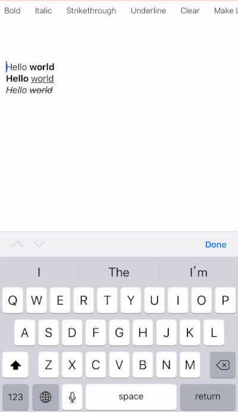
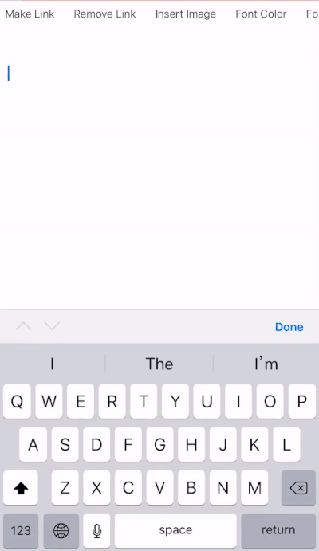

[](https://travis-ci.org/OneupNetwork/SQRichTextEditor)
[](https://cocoapods.org/pods/SQRichTextEditor)
[](https://cocoapods.org/pods/SQRichTextEditor)
[](https://cocoapods.org/pods/SQRichTextEditor)
[](https://git.zsinfo.nl/Zandor300/GeneralToolsFramework)

## Introduction
I was looking for a WYSIWYG text editor for iOS and found some solutions but all of them didn't use `WKWebView`. Apple will stop accepting submissions of apps that use UIWebView [APIs](https://developer.apple.com/documentation/uikit/uiwebview). I found a [HTML5 rich text editor](https://github.com/neilj/Squire), which provides powerful cross-browser normalisation in a flexible lightweight package. So I built this project and an iOS [bridge](https://github.com/OneupNetwork/Squire-native-bridge) for sending messages between Swift and JavaScript in WKWebView. 

## Example

To run the example project, clone the repo, and open `SQRichTextEditor.xcworkspace` from the Example directory.




## Requirements

- Deployment target iOS 10.0+
- Swift 5+
- Xcode 11+

## Installation

SQRichTextEditor is available through [CocoaPods](https://cocoapods.org). To install
it, simply add the following line to your Podfile:

```ruby
pod 'SQRichTextEditor'
```

## Features

- [x] Bold
- [x] Italic
- [x] Underline
- [x] Strikethrough
- [x] Insert Image
- [x] Insert HTML
- [x] Make Link
- [x] Text Color
- [x] Text Size
- [x] Text Background Color
- [ ] Alignment: Left
- [ ] Alignment: Center
- [ ] Alignment: Right
- [ ] Undo
- [ ] Redo
- [ ] Default Toolbar

## Getting Started
The `SQTextEditorView` is a plain UIView subclass, so you are free to use it wherever you want.

```swift
import SQRichTextEditor

private lazy var editorView: SQTextEditorView = {
        let _editorView = SQTextEditorView(frame: .zero)
        _editorView.translatesAutoresizingMaskIntoConstraints = false
        return _editorView
}()

view.addSubview(editorView)
editorView.topAnchor.constraint(equalTo: collectionView.bottomAnchor, constant: 10).isActive = true
editorView.leftAnchor.constraint(equalTo: view.leftAnchor, constant: 10).isActive = true
editorView.rightAnchor.constraint(equalTo: view.rightAnchor, constant: -10).isActive = true
editorView.bottomAnchor.constraint(equalTo: view.safeAreaLayoutGuide.bottomAnchor, constant: -10).isActive = true

```

### Delegate

You can check events by implement SQTextEditorDelegate:

```swift
editorView.delegate = self
```

Delagate has this functions:

```swift
//Called when the editor components is ready.
@objc optional func editorDidLoad(_ editor: SQTextEditorView)
    
//Called when the user selected some text or moved the cursor to a different position.
@objc optional func editor(_ editor: SQTextEditorView,
                               selectedTextAttributeDidChange attribute: SQTextAttribute)
    
//Called when the user inserted, deleted or changed the style of some text.
@objc optional func editor(_ editor: SQTextEditorView,
                               contentHeightDidChange height: Int)
```

## Editor Functions

### getHTML
Returns the HTML value of the editor in its current state.

```swift
func getHTML(completion: @escaping (_ html: String?) -> ())
```

### insertHTML
Inserts an HTML fragment at the current cursor location, or replaces the selection if selected. The value supplied should not contain <body> tags or anything outside of that. A block to invoke when script evaluation completes or fails.


```swift
func insertHTML(_ html: String, completion: ((_ error: Error?) -> ())? = nil)
```

### getSelectedText
The text currently selected in the editor.


```swift
func getSelectedText(completion: @escaping (_ text: String?) -> ())
```

### bold
Makes any non-bold currently selected text bold (by wrapping it in a 'b' tag), otherwise removes any bold formatting from the selected text. A block to invoke when script evaluation completes or fails.


```swift
func bold(completion: ((_ error: Error?) -> ())? = nil)
```

### italic
By wrapping it in an 'i' tag.

```swift
func italic(completion: ((_ error: Error?) -> ())? = nil)
```

### underline
By wrapping it in an 'u' tag.

```swift
func underline(completion: ((_ error: Error?) -> ())? = nil)
```

### strikethrough
By wrapping it in an 'del' tag.

```swift
func strikethrough(completion: ((_ error: Error?) -> ())? = nil)
```

### setTextColor
Sets the colour of the selected text.

```swift
func setText(color: UIColor, completion: ((_ error: Error?) -> ())? = nil)
```

### setTextBackgroundColor
Sets the colour of the background of the selected text.

```swift
func setText(backgroundColor: UIColor, completion: ((_ error: Error?) -> ())? = nil)
```

### setTextSize
Sets the font size for the selected text.

```swift
func setText(size: Int, completion: ((_ error: Error?) -> ())? = nil)
```
    
### insertImage
Inserts an image at the current cursor location. A block to invoke when script evaluation completes or fails.

```swift
func insertImage(url: String, completion: ((_ error: Error?) -> ())? = nil)
```

### makeLink
Makes the currently selected text a link. If no text is selected, the URL or email will be inserted as text at the current cursor point and made into a link. A block to invoke when script evaluation completes or fails.

```swift
func makeLink(url: String, completion: ((_ error: Error?) -> ())? = nil)
```

### removeLink
Removes any link that is currently at least partially selected. A block to invoke when script evaluation completes or fails.

```swift
func removeLink(completion: ((_ error: Error?) -> ())? = nil)
```

### clear
Clear Editor's content. Method removes all Blocks and inserts new initial empty Block
     `<div><br></div>`. A block to invoke when script evaluation completes or fails.

```swift
func clear(completion: ((_ error: Error?) -> ())? = nil)
```

## Contributions

`SQRichTextEditor` welcomes both fixes, improvements, and feature additions. If you'd like to contribute, open a pull request with a detailed description of your changes. 

If you'd like to fix or add some functions for `editor.js` or `editor.css`, you can open a pull request in this [repo](https://github.com/OneupNetwork/Squire-native-bridge).
   
## Author

Yuwei Lin, jesse@gamer.com.tw @ [OneupNetwork](https://www.gamer.com.tw/)

## License

SQRichTextEditor is available under the MIT license. See the LICENSE file for more info.


## Attribution

`SQRichTextEditor` uses portions of code from the following powerful source:

| Component     | Description   | License  |
| :------------ | :------------ | :------------ |
| [Squire](https://github.com/neilj/Squire) | Squire is an HTML5 rich text editor, which provides powerful cross-browser normalisation in a flexible lightweight package. | [MIT](https://github.com/neilj/Squire/blob/master/LICENSE) |
| [EFColorPicker](https://github.com/EFPrefix/EFColorPicker) | A lightweight color picker in Swift. | [MIT](https://github.com/EFPrefix/EFColorPicker/blob/master/LICENSE) |
